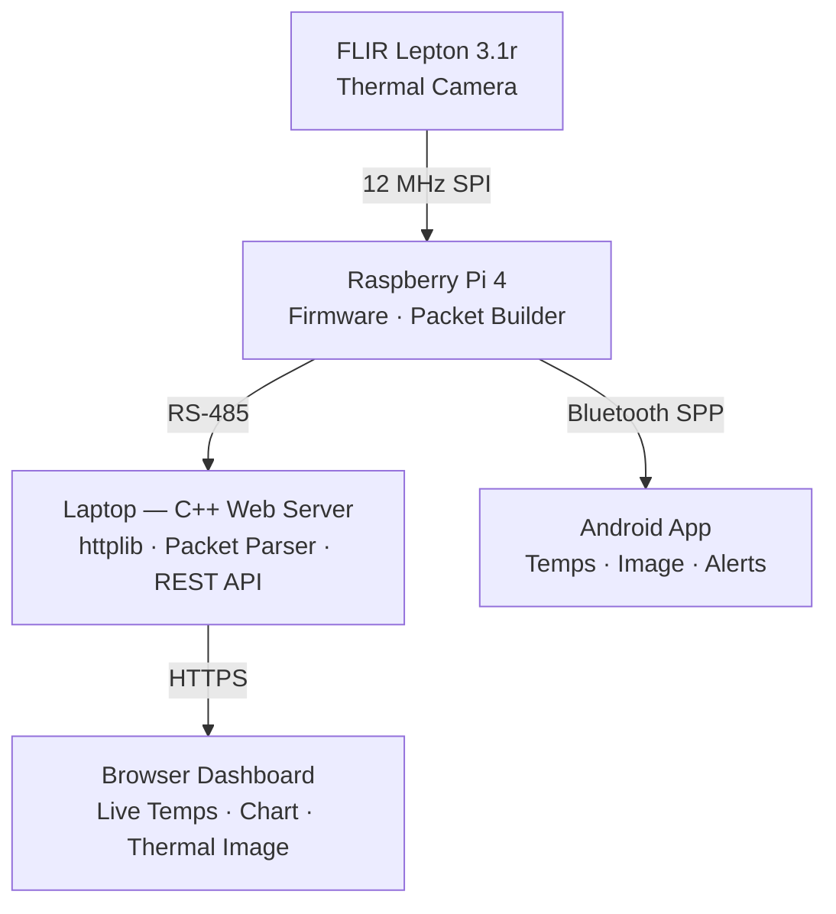

# Thermal Monitoring System
**Industry-Sponsored Senior Capstone — Marquette University**  
**Sponsor: Dynamic Ratings**

A real-time thermal monitoring system for medium-voltage electrical 
switchgear inspection. The system captures thermal imaging data from 
a FLIR Lepton 3.1r camera, transmits it over RS-485 to a web 
dashboard, and streams wirelessly to an Android app over Bluetooth

## System Architecture

